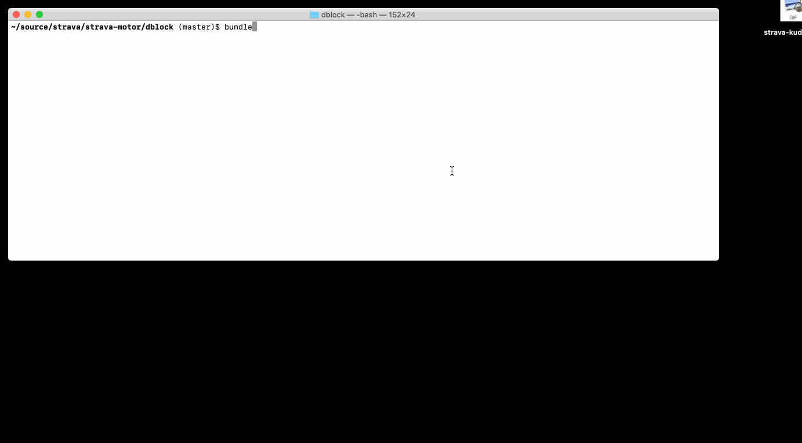

## What's This?

Automate me some Strava. For example, give kudos to everyone you follow. We'll click those buttons for you.



### Usage

Create a `.env` file with the following contents.

```
STRAVA_EMAIL=...
STRAVA_PASSWORD=...
```

Make sure you got Ruby and Firefox installed, then run the followinng.

```bash
bundle install
bundle exec ruby kudo.rb
```

### Disclaimer

Since there's no API to give kudos, this could be possibly against Strava terms of use, but IANAL. Use at your own risk.

### License

[MIT License](LICENSE.md)
